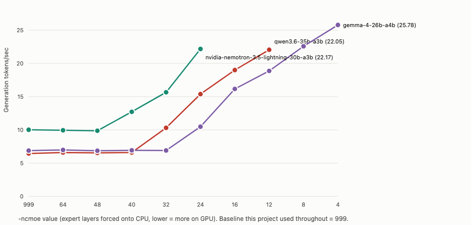
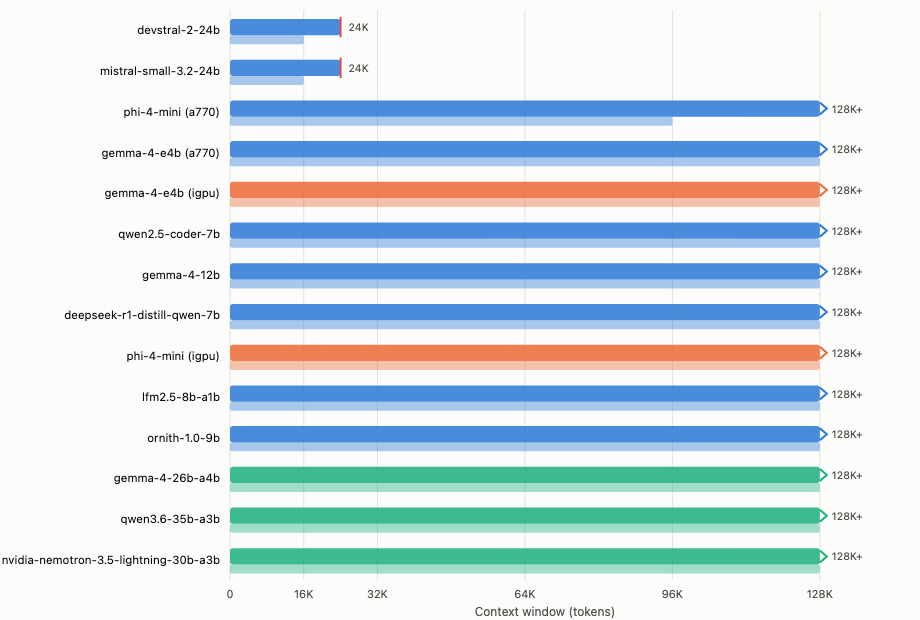
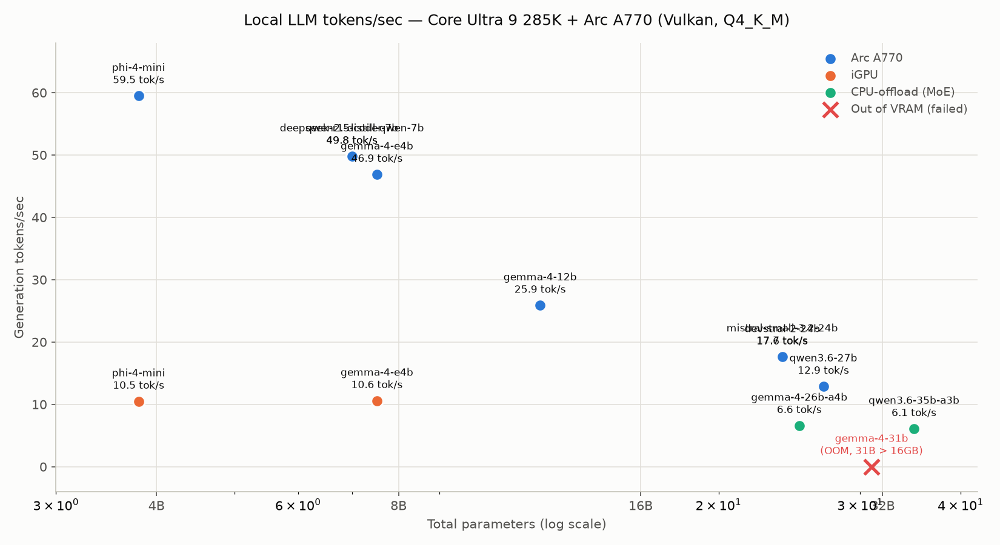

# intel-llm-bench

Real, measured tokens/sec for running local LLMs across the different compute engines
on a modern Intel desktop platform — CPU, integrated GPU, discrete Arc GPU, and NPU —
so you don't have to trust secondhand blog numbers to figure out the sweet spot between
model size and speed on this kind of hardware.

Every number here was actually run, not sourced from a vendor spec sheet or an
aggregator blog. Where something *didn't* work, that's recorded too — the failures are
as useful as the successes if you're planning your own setup.

## Hardware under test

- CPU: Intel Core Ultra 9 285K (Arrow Lake-S desktop, 24 cores / 24 threads)
- iGPU: on-die Xe-LPG (uses system RAM, no dedicated VRAM)
- Discrete GPU: Intel Arc A770 (16GB dedicated VRAM)
- NPU: on-die Arrow Lake NPU, 13 TOPS ("NPU 3" generation — the same generation used in
  2023's Meteor Lake, *not* the newer 48 TOPS NPU 4 in Lunar Lake mobile chips; Intel
  deliberately shipped the smaller NPU on this desktop part and spent the die area on
  CPU cores instead)
- 128GB DDR5 system RAM (relevant for the MoE CPU-offload results — see below)

If you're evaluating whether to buy an Arc A770, or whether your Arrow Lake iGPU/NPU
are worth bothering with for local LLM work, this is meant to save you the trial and
error.

## Methodology

### Backend selection — measured, not assumed

The obvious move is `llama.cpp` with the Vulkan backend — it's the simplest to set up
and the numbers you'll find online mostly use it. But Vulkan is Intel's *generic*
compute backend, not an Intel-optimized one — it explicitly does not use the Arc GPU's
matrix-acceleration cores. Two more "Intel-optimized" alternatives exist, so before
running the real matrix we tested all three head-to-head on the same reference model:

| Backend | Result |
|---|---|
| **`llama.cpp` + Vulkan** | **Works.** The baseline/portable choice — no matrix-core acceleration, but reliable. |
| `llama.cpp` + SYCL (Intel oneAPI) | **Crashes.** `UR_RESULT_ERROR_OUT_OF_RESOURCES` on the first tensor copy, even with a fully current oneAPI + GPU driver stack. Level-Zero doesn't register as a usable device at all; falls back to OpenCL, which then crashes. Matches a live upstream report (`ggml-org/llama.cpp#13775`) of iGPU+dGPU-together confusing SYCL enumeration. Four distinct fix attempts tried (env vars, forced device indices, full card-level device access instead of render-node-only, confirming it's not concurrent-GPU contention) — all failed, the last two converging on a hard segfault in Level-Zero's own device enumeration with zero other GPU users active. This reads as a genuine driver/kernel bug on this host, not a config problem. |
| OpenArc (OpenVINO-based, actively maintained community project) | **Crashes on current architectures.** OpenVINO GenAI's stateful LLM pipeline doesn't yet support some 2026-era model graph shapes (`RuntimeError: Model should have 3 or 4 inputs... but you have '5' inputs`) — this matched a live upstream OpenVINO bug report for a different model family, so it's a real, current gap, not a one-off. |
| IPEX-LLM (Intel's own PyTorch-based LLM library) | **Not viable at all** — Intel archived the upstream repo (made it read-only) in January 2026. Its GitHub-distributed portable build hasn't shipped an update since mid-2025 and doesn't even bundle a benchmarking tool. |

**Result: Vulkan runs the actual benchmark matrix.** Not because it's the theoretical
ceiling — it isn't — but because it's the only backend that reliably runs the current
generation of open-weight models on this hardware. If you're reading this later and
want to try SYCL or OpenArc again, they're worth periodic retesting — both are
genuinely active projects and this is exactly the kind of gap that can close within
weeks.

### Benchmark parameters

- `llama-bench`, prompt-processing test at 512 tokens, generation test at 128 tokens, 3
  repetitions each, results averaged.
- All models quantized to Q4_K_M (or the nearest equivalent, e.g. `UD-Q4_K_M` for the
  MoE entries) — a standard, widely-used quantization level, not cherry-picked for any
  one model.
- Device targeting: `Vulkan0` = discrete Arc GPU, `Vulkan1` = integrated GPU (confirmed
  via `llama-bench --list-devices` — Vulkan device ordering isn't necessarily consistent
  across backends, so don't assume it matches other tools' numbering).
- MoE models use `-ncmoe` (llama.cpp's dedicated MoE-CPU-offload flag) to force expert
  weights onto system RAM while keeping shared/attention layers on the discrete GPU —
  this is what lets a MoE model larger than the GPU's VRAM run at all. The main results
  table below uses `-ncmoe 999` (full offload) for every MoE entry, for a consistent
  baseline across the matrix — but that baseline turned out to be badly suboptimal. See
  "The MoE offload flag we were setting wrong" below for the tuned numbers.

### NPU

The NPU can't be reached through `llama.cpp`+Vulkan at all — it's not a Vulkan-capable
device, only OpenVINO's NPU plugin reaches it. Since OpenArc/OpenVINO's LLM pipeline is
what's currently broken (see above), a chat-model NPU test would hit the same wall.

Instead, the NPU was tested against the workload it's actually architected for:
embedding/vectorization (OpenVINO 2026.0 specifically added NPU support for
`Qwen3-Embedding-0.6B`, and separately for Whisper speech-to-text — this is a real,
current, Intel-shipped capability, not speculation). Result: the NPU compiler requires
*static* input shapes (it compiles a fixed execution graph ahead of time, unlike a GPU),
and the default export tooling produces dynamic shapes —
`optimum-cli`'s NPU-specific quantization flags don't fix this; it needs a manual
`model.reshape()` call via the OpenVINO Python API before compiling. That's real,
scoped follow-up work, not something achievable through this benchmark's
download-and-run pattern — noted here rather than silently skipped.

**Takeaway if you're deciding whether to bother with your NPU:** it's real, current,
Intel-supported technology for small fixed-shape workloads (embeddings, STT/TTS) — not
useless — but it needs dedicated setup work beyond what a generic benchmark harness
does automatically, and it was never going to compete with a discrete GPU on raw LLM
decode throughput anyway (13 TOPS is a fraction of even a modest discrete GPU's
compute).

We went ahead and did that dedicated setup work: used OpenVINO's real Python API
(`model.reshape()`) to force the model's external inputs from dynamic to static
`[1, 512]` — confirmed working. Reloading onto the NPU hit the **exact same error at the
exact same internal line**, meaning the actual problem is an internal reshape deep
inside a self-attention layer that stays dynamic regardless of the external signature —
not something a post-hoc reshape fixes. No export-time static-shape flag exists in
`optimum-cli` either. Three real, distinct attempts, same wall each time — this looks
like a genuine gap in how this model's attention traces for the NPU compiler
specifically, not a config issue.

### The MoE offload flag we were setting wrong

Every MoE result in this project used `-ncmoe 999` — llama.cpp's flag for forcing expert
layers onto the CPU. We set it to the max because it was the safe, simple choice: dump
everything, guarantee it fits, move on. That turned out to be a mistake.

A reader found a Reddit post claiming ~10 tokens/sec running Qwen3.6-35B-A3B on 8GB of
VRAM and 32GB of system RAM, and asked why our own numbers, on a 16GB card with 128GB of
RAM, were slower. The answer was `-ncmoe`. It's not an on/off switch: `-ncmoe N` keeps the
first N layers' MoE weights on the CPU, and the smaller N is, the more expert layers stay
resident on the GPU, where compute is dramatically faster. Setting N to 999 offloads
every layer that exists — throwing away whatever VRAM headroom the card actually has.

We tuned it. For each of the three MoE models in this matrix, we swept `-ncmoe` from 999
down until the model failed to load, and re-benchmarked at every step:



| Model | `-ncmoe 999` (what we'd been using) | Best tuned value | Peak throughput | Speedup |
|---|---|---|---|---|
| qwen3.6-35b-a3b | 6.5 tok/s | `-ncmoe 12` | 22.1 tok/s | 3.4x |
| gemma-4-26b-a4b | 6.9 tok/s | `-ncmoe 4` | 25.8 tok/s | 3.7x |
| nvidia-nemotron-3.5-lightning-30b-a3b | 10.0 tok/s | `-ncmoe 24` | 22.2 tok/s | 2.2x |

At `-ncmoe 12`, qwen3.6-35b-a3b already beats the Reddit report's ~10 tok/s, on the same
model, with real headroom left on the card. The 16GB A770 was never really the
bottleneck. The flag was.

Two of these hit a real ceiling rather than a graceful stop. gemma-4-26b-a4b's next step
down (`-ncmoe 0`, every expert on GPU) hung for over 30 minutes instead of failing
cleanly, so we killed it and stopped at `-ncmoe 4`. Nemotron's next step (`-ncmoe 16`)
OOM'd immediately with a clear Vulkan allocation error — the more useful failure mode,
since it tells you exactly where the wall is instead of leaving you to guess whether it's
still loading.

If you're running a MoE model on a card with VRAM to spare, don't reach for full offload
by default. Start high, drop the value until it stops loading, and use the last value
that worked. It's the difference between "MoE offload is slow" and "MoE offload is
actually pretty good, once you stop fighting it."

### Putting a tuned MoE model into real production use

The tuning sweep above found qwen3.6-35b-a3b's fastest value, `-ncmoe 12`, at a small
default context. Deploying it for actual daily use meant answering a question the sweep
never asked: does the fastest value still work once you need a real context window? It
didn't. `-ncmoe 12` at a 131072-token context OOMs — the same VRAM that full GPU-resident
experts want is the VRAM a large KV cache needs, and at `-ncmoe 12` there isn't enough
left over. `-ncmoe 16` (19.0 tok/s, a step down from the sweep's peak) fits cleanly at
the full 131072 tokens, confirmed via `intel_gpu_top` at 16.2GB — right at the card's
ceiling, stable, no OOM. That's the real number this hardware delivers once you also
need the context to match: **19.0 tok/s at a genuine 128K window, still beating the
24B dense model that had been running in production before it (17.6 tok/s) at that
model's smaller 28K context.**

One more thing the raw throughput number hides: qwen3.6-35b-a3b is a reasoning model.
Every tool call or response is preceded by roughly 150-200 tokens of visible
chain-of-thought before anything else happens — confirmed by querying `llama-server`
directly and reading the `reasoning_content` field this build's `--jinja` template
exposes separately from the final answer. At 19 tok/s that's a real, standing 8-10
second tax before the model takes any action, on every turn. The dense model it
replaced had no equivalent preamble. A reasoning MoE model can win on raw tok/s and
still feel slower in practice, which matters if you're picking one for anything
latency-sensitive.

### When the model won't stop thinking

A tokens/sec number also hides how much of a reasoning model's *own* output budget it
wastes on itself. Four real tasks — implementing an interval-merge function, a
rate/work math problem, a five-bug code review, and a repeat of the interval-merge test
— all got genuinely correct answers from qwen3.6-35b-a3b. The code review caught a bug
many models miss (a bare `except:` also swallows `KeyboardInterrupt`). But every task
took 1.5 to 2.5 minutes, and reading the raw reasoning trace showed why: the model
wasn't reasoning carefully, it was reasoning *redundantly* — arriving at the fully
correct answer early, then re-deriving and re-verifying that same answer three or four
more times before finally committing to it. One run, given a 2500-token reasoning
budget (generous by most standards), got cut off mid-function despite having already
solved the problem correctly inside its own reasoning — the budget was consumed by
repetition, not by the work.

This isn't specific to this deployment. Qwen's own model card and independent guides
document "overthinking" as a known characteristic of the Qwen 3.5/3.6 family, and one
of the most common developer complaints about it — the model has no strong learned
signal for when to stop. Alibaba's own fix is a dedicated fine-tune
(ThinkingCap-Qwen3.6-27B) that cuts reasoning tokens roughly 46% with no accuracy loss,
which is itself confirmation this is a real, already-acknowledged problem rather than
something specific to one setup.

The model card's official recommendation for coding tasks — temperature 0.6, top_p
0.95, top_k 20, in place of temperature 0 — was tested first, and it didn't help: the
interval-merge task at those settings ran the same length (140s, statistically
identical token count to the temp=0 baseline) and, worse, produced a wrong worked
example in its own explanation (`[[1, 3], [8, 10], [15, 18]]` instead of the correct
`[[1, 6], [8, 10], [15, 18]]`) — the generated code was still correct, but the sampling
randomness caused a real error in the model's own trace-through of it, something the
deterministic temp=0 runs never did across two separate tests. The official
recommendation didn't get adopted over that result.

What actually worked was `--reasoning-budget`, a flag this build of `llama-server`
exposes specifically to cap the thinking phase (not the total response) at a fixed
token count. At 600 tokens, the interval-merge task went from 140s/2573 tokens down to
43s/771 tokens, still correct. At 1500 tokens, the five-bug code review went from
159s/2886 tokens to 98s/1744 tokens, still caught all five real bugs — the fix was
arguably *more* professional than the unconstrained version, using a real
`logging.error()` plus `raise` instead of silently swallowing the exception. Deployed
at 1500: generous enough for the hardest task tested, while cutting real latency
35-70% depending on task complexity, with no quality regression observed across either
test.

### What happens when two things ask it at once

Every number in this project, including the ones above, is a single request running
alone. `llama-server` here is actually configured for up to 4 concurrent request slots
(`n_slots=4`, with a unified/pooled KV cache rather than a fixed per-slot split), so it's
worth asking what happens to per-request speed when more than one of those slots is
actually busy at the same time. Pulled every real moment of genuine concurrent
generation (not just concurrent connections — both slots actively producing tokens in
the same window) out of this project's own operational logs:

| Concurrent requests | Slot A | Slot B | Combined |
|---|---|---|---|
| 2 | 13.4 tok/s | 14.6 tok/s | 28.0 tok/s |
| 2 | 6.6 tok/s | 6.8 tok/s | 13.5 tok/s |
| 2 | 7.3 tok/s | 8.8 tok/s | 16.1 tok/s |

There's no single rule here, and that's the finding. Solo throughput on this model sits
around 13-14 tok/s. In one real instance, two concurrent requests both ran at
essentially full solo speed simultaneously — 28 tok/s combined, close to genuine free
parallelism. In another, both requests dropped to roughly half speed each, landing
right back at the solo baseline in aggregate — the GPU's throughput budget was simply
being divided, not added to. A likely factor: MoE models route different tokens to
different experts, so how well two concurrent sequences batch together on the GPU can
depend on whether they happen to need overlapping expert weights at that instant, not
just on how many requests are in flight. Whatever the exact mechanism, the practical
takeaway holds regardless: don't assume multiple concurrent requests against a single
consumer GPU are free. Sometimes they nearly are. Often they aren't, and there's no
reliable way to know in advance which you'll get.

### How much context can you actually get?

Every throughput number in this project comes from a 512-token benchmark prompt. That
says nothing about whether a model can serve a real context window, and the gap between
"benchmarks fine" and "actually deployable" turned out to be bigger than we assumed.

We swept context size from 8K to a 128K test ceiling, at both standard and quantized
(q8_0) KV cache, for every model in the matrix. The first pass came back wrong: the
persistent production server (devstral-2-24b) was still running the whole time, quietly
eating 16.7GB of the card's 16GB VRAM. A model we'd already proven works fine at 8K came
back "fails at the smallest checkpoint." That contradiction is what caught it. We stopped
production, threw out the run, and redid it clean.

Only two models, both 24B dense, hit a real wall in this range. devstral-2-24b and
mistral-small-3.2-24b cap out at 16K tokens with standard KV cache, 24K with quantized.
Every other model tested, dense or MoE, reached the 128K test ceiling without failing.
The true limit is higher than we tested, not lower than you'd hope.



| Model | Device | Standard KV | Quantized (q8_0) KV |
|---|---|---|---|
| devstral-2-24b | Arc A770 | 16K | 24K |
| mistral-small-3.2-24b | Arc A770 | 16K | 24K |
| phi-4-mini | Arc A770 | 96K | 128K+ |
| gemma-4-e4b, qwen2.5-coder-7b, gemma-4-12b, deepseek-r1-distill-qwen-7b, lfm2.5-8b-a1b, ornith-1.0-9b | Arc A770 | 128K+ | 128K+ |
| phi-4-mini, gemma-4-e4b | iGPU | 128K+ | 128K+ |
| gemma-4-26b-a4b, qwen3.6-35b-a3b, nvidia-nemotron-3.5-lightning-30b-a3b | CPU-offload | 128K+ | 128K+ |

gemma-4-31b and qwen3.6-27b are excluded — their weights alone already exceed the A770's
16GB, so context size can't fix that (see the note on qwen3.6-27b below).

If you're sizing a 16GB card against a specific 24B-class dense model, check its real
context ceiling before assuming it'll hold up in a real conversation. 16K-24K tokens
sounds like a lot until you're a few turns into an actual coding session.

### Throughput isn't the whole story — measured, in two rounds

Everything above measures raw tokens/sec. That tells you whether a model is *fast
enough* — it says nothing about whether it's actually *good* at tool-calling, multi-step
instruction following, or reliable structured output, which is what matters if you're
trying to run agentic/coding-assistant workloads locally rather than just chat. So we
built a real eval instead of trusting model-card positioning, and it took two rounds to
get a result that actually meant something.

**Round 1 — a 5-question smoke test** (single tool call, multi-arg extraction, 2-step
tool chaining, correctly declining to call a tool, structured JSON output) against
`llama-server`'s OpenAI-compatible API with real tool schemas:

| Model | Pass rate | Generation (tok/s) |
|---|---|---|
| devstral-2-24b | 5/5 | 17.6 |
| gemma-4-12b | 5/5 | 25.9 |
| qwen3.6-27b (reduced context, see caveat below) | 5/5 | 12.9 |
| phi-4-mini | 2/5 | 59.5 |
| deepseek-r1-distill-qwen-7b | 2/5 | 49.8 |

This cleanly ruled out two models — `phi-4-mini`, the *fastest* model in the whole
benchmark, answered every tool-calling test as if no tools had been offered to it at
all; raw speed told us nothing about that failure. But three models tied at 5/5, and
a 5-question test that three different models all max out has no power left to tell you
which is actually better. Don't stop here.

**Round 2 — a harder eval**, built specifically to discriminate among models that clear
the easy bar: a 3-step tool chain requiring real arithmetic on a returned value (compute
10% of a line count a tool just reported), tool-selection precision among 8 tools
including a plausible-but-wrong decoy, error recovery (retry with a corrected argument
after a tool-call error), multi-call aggregation requiring genuine comparison across 3
sequential results, and — the one that matters most for coding-assistant use — **actual
code-fix correctness**, grading the real generated diff against a genuine off-by-one bug,
not just whether the call format was valid.

| Model | Pass rate (6 tests) | What separated it |
|---|---|---|
| **devstral-2-24b** | **5/6** | Only model to correctly fix the actual bug, and the only one to pick the precise tool over a plausible decoy |
| qwen3.6-35b-a3b (MoE, CPU-offloaded experts) | 4/6 | Passed tool-selection and aggregation; failed the code-fix and error-recovery tests |
| gemma-4-12b | 3/6 | Repeatedly defaulted to a "search" tool in situations calling for a more direct one — a pattern the easy test never exercised |

Every model failed the error-recovery test — a real, universal gap worth its own
follow-up, not something specific to one model.

**qwen3.6-27b's Round 1 pass doesn't hold up, and this is worth knowing if you're
shopping for a 16GB card.** Checked with `intel_gpu_top`, not assumed: its Q4_K_M GGUF is
16.8GB — **larger than the A770's entire 16GB VRAM by itself**, before any context or KV
cache. Two independent clean reload attempts (nothing else resident on the GPU) both hit
an identical `failed to fit params to free device memory` abort. The original Round 1
"pass" at a squeezed 4096-token context with quantized KV cache was very likely not
actually fully GPU-resident — this build of `llama.cpp` hard-aborts when forced GPU
layers don't fit rather than silently falling back to partial CPU offload, so whatever
state let it load once wasn't representative. This also explains its oddly low
throughput in the main matrix above (12.9 tok/s vs. a similar-sized 24B dense model's
17.6 tok/s) — it may never have been running fully on-GPU in this benchmark either.
**If you're deciding between a 16GB Arc card and a specific 27B-class dense model,
check the actual quantized file size against your VRAM before assuming it'll fit — a
"successful" first load isn't proof it's staying fully resident.**

**Bottom line if you're picking a model for agentic/coding-assistant use from this
kind of hardware:** don't trust a 5-question smoke test, and don't trust "agentic" model
positioning either — Devstral's explicit agentic-coding design intent held up under a
harder test, but Qwen 3.6's equally strong positioning couldn't even get a fair test on
this card, and Gemma 4 (no comparable marketing) still beat the smoke test's other
model. Build a test that's actually hard enough to separate the candidates, and verify
VRAM fit with real tooling before trusting a benchmark's "it loaded" as proof of a clean
deployment.

## Results



Three model families joined this round: **nvidia-nemotron-3.5-lightning-30b-a3b** (first
NVIDIA-family entry), **lfm2.5-8b-a1b** (Liquid AI's non-transformer LFM architecture,
now the fastest model in the whole matrix by more than 2x), and **ornith-1.0-9b**
(DeepReinforce AI, solid but unremarkable for its size).

| Model | Params (total/active) | Device | Prompt proc. (tok/s) | Generation (tok/s) |
|---|---|---|---|---|
| **lfm2.5-8b-a1b** | 8.0B / 1B active | Arc A770 | 2180.3 | **126.5** |
| phi-4-mini | 3.8B | Arc A770 | 1746.4 | 59.5 |
| deepseek-r1-distill-qwen-7b | 7.0B | Arc A770 | 929.4 | 49.8 |
| qwen2.5-coder-7b | 7.0B | Arc A770 | 925.4 | 49.8 |
| gemma-4-e4b | 7.5B | Arc A770 | 796.4 | 46.9 |
| ornith-1.0-9b | 9.0B | Arc A770 | 663.3 | 37.4 |
| gemma-4-12b | 12.0B | Arc A770 | 342.6 | 25.9 |
| devstral-2-24b | 24.0B | Arc A770 | 307.2 | 17.6 |
| mistral-small-3.2-24b | 24.0B | Arc A770 | 306.2 | 17.7 |
| qwen3.6-27b † | 27.0B | Arc A770 | 205.5 | 12.9 |
| **gemma-4-31b** | **31.0B** | **Arc A770** | — | **FAILED — out of VRAM** |
| nvidia-nemotron-3.5-lightning-30b-a3b (MoE) ‡ | 30.0B / 3B active | CPU-offload | 204.1 | 9.9 |
| gemma-4-26b-a4b (MoE) ‡ | 25.2B / 3.8B active | CPU-offload | 220.9 | 6.6 |
| qwen3.6-35b-a3b (MoE) ‡ | 35.0B / 3B active | CPU-offload | 152.7 | 6.1 |
| phi-4-mini | 3.8B | iGPU | 218.7 | 10.5 |
| gemma-4-e4b | 7.5B | iGPU | 138.7 | 10.6 |

The `gemma-4-31b` failure is real data, not an error to fix: at Q4_K_M it needs roughly
17GB, just over the A770's 16GB VRAM — this is the actual ceiling for a single dense
model on this card, found empirically rather than estimated. The two 24B dense models
(Devstral, Mistral Small) landing within 0.1 tok/s of each other despite being from
different labs is a good sanity check on the methodology.

‡ **These MoE numbers use `-ncmoe 999` (full CPU offload) for a consistent baseline
across the matrix — they're not the best this hardware can do.** See "The MoE offload
flag we were setting wrong" above: tuning `-ncmoe` down gets 2-4x more throughput out of
every MoE model here.

† **qwen3.6-27b's number above is likely not a clean full-GPU result.** Its Q4_K_M file
is 16.8GB — larger than the A770's entire VRAM capacity by itself. Later testing (see
the agentic-eval section below) found this model reliably fails to load at all on a
fresh, otherwise-idle GPU, confirmed with `intel_gpu_top`. Its unusually low throughput
here relative to a similar-sized 24B dense model is consistent with it having silently
fallen back to partial CPU offload during this run rather than running fully on-GPU as
requested.

MoE models at full CPU offload (`-ncmoe 999`) all land around 6-10 tok/s regardless of
total size, since active-parameter count, not total, dominates memory-bandwidth-bound
decode speed once every expert is streaming from system RAM. That's the worst-case
number, not the real one — tuning `-ncmoe` down gets 2-4x more out of the same models,
see above.

## Reproducing this

```bash
# 1. Build the backend (Vulkan — see build-vulkan.sh; build-sycl.sh included for
#    reference/retesting, but crashed on this hardware as of this run)
./build-vulkan.sh

# 2. Edit models.yaml to your own model list, or use the one here as a starting point

# 3. Run the whole matrix (resumable — safe to interrupt and re-run)
./run-matrix.sh

# 4. Aggregate into a CSV + summary table
python3 aggregate-results.py results.jsonl results.csv
```

`bench-model.sh` downloads one model at a time, benchmarks it, deletes it, and appends
one JSON line to `results.jsonl` — so this never needs more than one model's worth of
disk space resident at once, and a `failed` status gets recorded (with the real error)
rather than silently skipped if a model won't load.

### Reproducing the agentic eval

```bash
# Round 1 — smoke test. Requires a running llama-server on :8080 with the model
# you want to test already loaded (--jinja, tools support required).
python3 agentic-eval.py <model-name-for-the-record>

# Round 2 — harder eval. Same requirement, defaults to :8081 so it doesn't collide
# with anything you already have serving on :8080 (override via LLM_BENCH_PORT).
python3 agentic-eval-v2.py <model-name-for-the-record>
```

Both scripts hit `/v1/chat/completions` directly with real OpenAI-format tool schemas —
no framework, no mocking. Results append to a local `.jsonl` file so you can run
multiple models across multiple sessions and compare afterward.

### Reproducing the context-ceiling sweep

```bash
./context-sweep.sh <name> <repo> <file> <a770|igpu|cpu_offload>
```

Downloads the model, tries ascending context checkpoints (8K to 128K) at both standard
and quantized KV cache, stops at the first checkpoint that fails to load within 35
seconds — a hang counts as a failure, same as a clean OOM, because both mean "don't
deploy at this size." Deletes the model when done. Make sure nothing else is resident on
the GPU before running this — a co-resident model will silently cap every result below
its real ceiling (see the finding above).

### Reproducing the MoE offload tuning

```bash
./tune-moe-offload.sh <name> <repo> <file>
```

Sweeps `-ncmoe` from 999 down through progressively smaller values, re-running
`llama-bench` at each step with a timeout so a hang doesn't stall the whole sweep. Stops
at the first value that fails or times out — the last value that worked is your real
ceiling for that model on your card.

## Caveats

- Single hardware sample (one Core Ultra 9 285K + one Arc A770) — not a statistical
  claim about the SKUs in general, just what this specific setup actually does.
- All numbers are from a single quantization level (Q4_K_M-class). Quality/speed
  tradeoffs across quant levels aren't covered here.
- Backend landscape moves fast — SYCL and OpenArc/OpenVINO both failed on this hardware
  as of this test date, but both are actively developed. Don't treat "Vulkan won" as a
  permanent verdict; retest periodically.

## License

MIT — see `LICENSE`.
